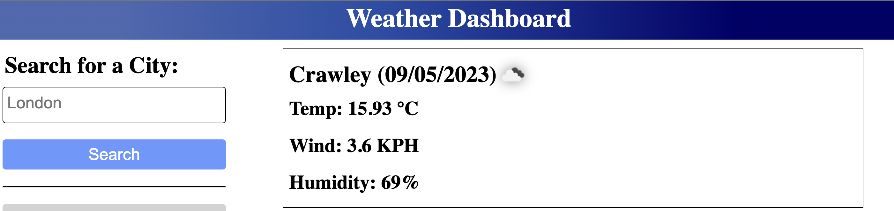
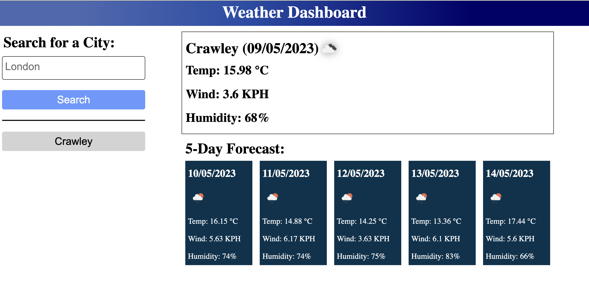
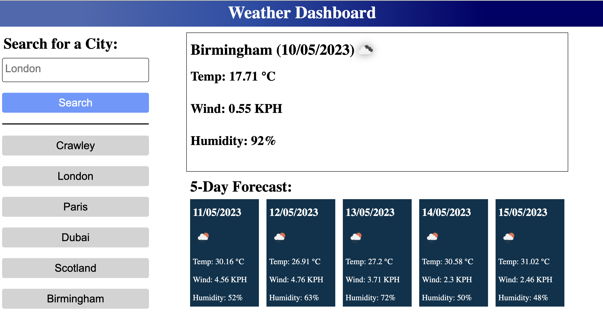

# Weather-Dashboard-Server-APIs-Project:
Challenge 8 : Server APIs - Weather Dashboard (Forecast App)
Server APIs allow developers to access their data and functionality by making requests with specific parameters to a URL.

# Project Requirements:
* Create a weather dashboard with form inputs.

* When a user searches for a city they are presented with current and future conditions for that city and that city is added to the search history.

* When a user views the current weather conditions for that city they are presented with:
  -The city name
  -The date
  -An icon representation of weather conditions
  -The temperature
  -The humidity
  -The wind speed

* When a user views future weather conditions for that city they are presented with a 5-day forecast that displays:
 -The date
 -An icon representation of weather conditions
 -The temperature
 -The humidity

* When a user clicks on a city in the search history they are again presented with current and future conditions for that city.

# Description of this Project: 
An application that utilizes the Server side APIs, OpenWeather, to retrieve weather data for cities and displays the weather (temperature, humidity, wind speed) of the current day and the weather (temperature, humidity and wind speed) for the five following days.
The motivation behind this project was to create a weather dashboard application where users can search for current and future weather conditions of cities around the world. I utilized my knowledge of calling to server-side APIs in order to extract data in real time and provide current and future weather conditions for any city the user would like to search. The site provides the user with the current day forecast as well as a 5 day forecast. Each day is given an icon unique representative of the current weather. Each day also provides the user with information about temperature (in degrees), wind (KPH), and humidity (%). Through building this application I learned how to properly retrieve data from a server side API, the importance of query-parameters used when calling the API, how reformat that data so it could then be appended to my page. This application helped me see how intricate function re-useability can become as well as its significance.

# Technologies Used:
 * HTML
 * CSS
 * JavaScript
 * OpenWeather API (server-side API). 
  
# Image Links of this Project:

* when a user open page then showing heading Weather Dashboard:

* when a user open page then left side showing Search for a city: and search button

* When a user searches for a city they are presented with current and future conditions for that city and that city is added to the search history:

* When a user views the current weather conditions for that city they are presented with:
  -The city name
  -The date
  -An icon representation of weather conditions
  -The temperature
  -The humidity
  -The wind speed
  

* When a user view future weather conditions for that city they are presented with a 5-day forecast that displays:
  -The date
  -An icon representation of weather conditions
  -The temperature
  -The humidity
    

 * When a user clicks on a city in the search history they are again presented with current and future conditions for that city.
  