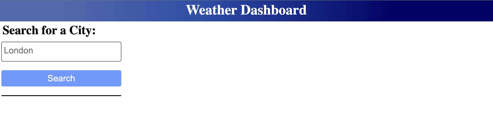

# Weather-Dashboard-Server-APIs-Project:

# when a user open page then showing heading Weather Dashboard:

# when a user open page then left side showing Search for a city: and search button

# When a user searches for a city they are presented with current and future conditions for that city and that city is added to the search history:

